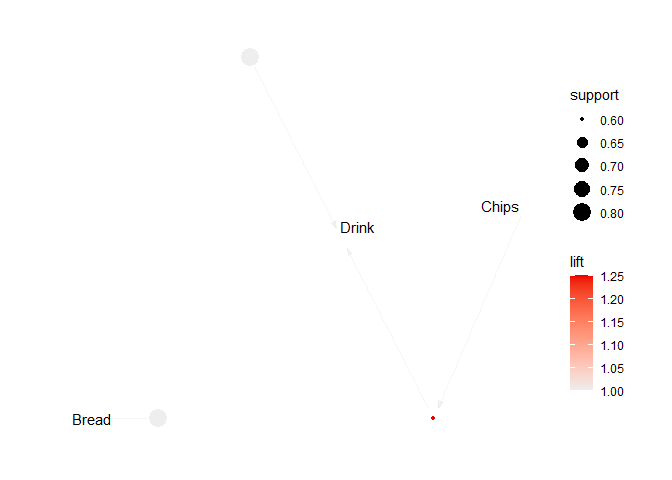
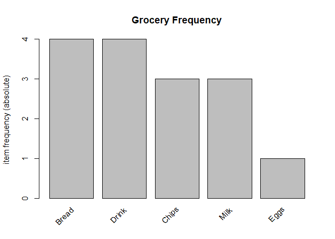

Apriori_Stuff
================
Donald
2024-03-10

## R Markdown

This is an R Markdown document. Markdown is a simple formatting syntax
for authoring HTML, PDF, and MS Word documents. For more details on
using R Markdown see <http://rmarkdown.rstudio.com>.

When you click the **Knit** button a document will be generated that
includes both content as well as the output of any embedded R code
chunks within the document. You can embed an R code chunk like this:

# Load the necessary libraries

``` r
# Load the necessary libraries
library(arules)
```

    ## Warning: package 'arules' was built under R version 4.3.3

    ## Loading required package: Matrix

    ## 
    ## Attaching package: 'arules'

    ## The following objects are masked from 'package:base':
    ## 
    ##     abbreviate, write

``` r
library(arulesViz)
```

    ## Warning: package 'arulesViz' was built under R version 4.3.3

``` r
# Define the transactions
transactions <- as(
  list(
    c("Bread", "Chips", "Eggs", "Drink"),
    c("Bread", "Chips", "Drink"),
    c("Bread", "Milk", "Yoghurt"),
    c("Bread", "Drink", "Milk"),
    c("Chips", "Drink", "Milk")
  ),
  "transactions"
)
```

# Run the Apriori algorithm

``` r
# Run the Apriori algorithm
rules <- apriori(transactions, parameter = list(supp = 0.5, conf = 0.8))
```

    ## Apriori
    ## 
    ## Parameter specification:
    ##  confidence minval smax arem  aval originalSupport maxtime support minlen
    ##         0.8    0.1    1 none FALSE            TRUE       5     0.5      1
    ##  maxlen target  ext
    ##      10  rules TRUE
    ## 
    ## Algorithmic control:
    ##  filter tree heap memopt load sort verbose
    ##     0.1 TRUE TRUE  FALSE TRUE    2    TRUE
    ## 
    ## Absolute minimum support count: 2 
    ## 
    ## set item appearances ...[0 item(s)] done [0.00s].
    ## set transactions ...[6 item(s), 5 transaction(s)] done [0.00s].
    ## sorting and recoding items ... [4 item(s)] done [0.00s].
    ## creating transaction tree ... done [0.00s].
    ## checking subsets of size 1 2 done [0.00s].
    ## writing ... [3 rule(s)] done [0.00s].
    ## creating S4 object  ... done [0.00s].

# Inspect the rules

``` r
# Inspect the rules
inspect(rules)
```

    ##     lhs        rhs     support confidence coverage lift count
    ## [1] {}      => {Drink} 0.8     0.8        1.0      1.00 4    
    ## [2] {}      => {Bread} 0.8     0.8        1.0      1.00 4    
    ## [3] {Chips} => {Drink} 0.6     1.0        0.6      1.25 3

# Visualize the rules

``` r
# Visualize the rules
plot(rules, method = "graph")
```

<!-- -->

``` r
write(rules)
```

    ## "rules" "support" "confidence" "coverage" "lift" "count"
    ## "1" "{} => {Drink}" 0.8 0.8 1 1 4
    ## "2" "{} => {Bread}" 0.8 0.8 1 1 4
    ## "3" "{Chips} => {Drink}" 0.6 1 0.6 1.25 3

# Plot the item frequencies

``` r
# Plot the item frequencies
itemFrequencyPlot(transactions, topN = 5, type = "absolute", main = "Grocery Frequency")
```

<!-- -->
