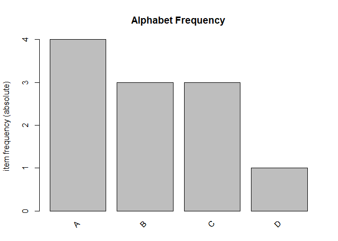

Apriori_Algorithm_2
================
Donald
2024-03-10

## R Markdown

This is an R Markdown document. Markdown is a simple formatting syntax
for authoring HTML, PDF, and MS Word documents. For more details on
using R Markdown see <http://rmarkdown.rstudio.com>.

When you click the **Knit** button a document will be generated that
includes both content as well as the output of any embedded R code
chunks within the document. You can embed an R code chunk like this:

# Load the necessary libraries

``` r
library(arules)
```

    ## Warning: package 'arules' was built under R version 4.3.3

    ## Loading required package: Matrix

    ## 
    ## Attaching package: 'arules'

    ## The following objects are masked from 'package:base':
    ## 
    ##     abbreviate, write

``` r
library(arulesViz)
```

    ## Warning: package 'arulesViz' was built under R version 4.3.3

``` r
transactions1 <- as(
  list(
    c("A", "B", "C"),
    c("A", "B"),
    c("A", "C"),
    c("A", "D"),
    c("B", "C")
  ),
  "transactions"
)
```

# Run the Apriori algorithm

``` r
rules1 <- apriori(transactions1, parameter = list(supp = 0.4, conf = 0.6))
```

    ## Apriori
    ## 
    ## Parameter specification:
    ##  confidence minval smax arem  aval originalSupport maxtime support minlen
    ##         0.6    0.1    1 none FALSE            TRUE       5     0.4      1
    ##  maxlen target  ext
    ##      10  rules TRUE
    ## 
    ## Algorithmic control:
    ##  filter tree heap memopt load sort verbose
    ##     0.1 TRUE TRUE  FALSE TRUE    2    TRUE
    ## 
    ## Absolute minimum support count: 2 
    ## 
    ## set item appearances ...[0 item(s)] done [0.00s].
    ## set transactions ...[4 item(s), 5 transaction(s)] done [0.00s].
    ## sorting and recoding items ... [3 item(s)] done [0.00s].
    ## creating transaction tree ... done [0.00s].
    ## checking subsets of size 1 2 3 done [0.00s].
    ## writing ... [7 rule(s)] done [0.00s].
    ## creating S4 object  ... done [0.00s].

# Inspect the rules

``` r
summary(rules1)
```

    ## set of 7 rules
    ## 
    ## rule length distribution (lhs + rhs):sizes
    ## 1 2 
    ## 3 4 
    ## 
    ##    Min. 1st Qu.  Median    Mean 3rd Qu.    Max. 
    ##   1.000   1.000   2.000   1.571   2.000   2.000 
    ## 
    ## summary of quality measures:
    ##     support         confidence        coverage           lift       
    ##  Min.   :0.4000   Min.   :0.6000   Min.   :0.6000   Min.   :0.8333  
    ##  1st Qu.:0.4000   1st Qu.:0.6333   1st Qu.:0.6000   1st Qu.:0.9167  
    ##  Median :0.4000   Median :0.6667   Median :0.6000   Median :1.0000  
    ##  Mean   :0.5143   Mean   :0.6667   Mean   :0.7714   Mean   :0.9841  
    ##  3rd Qu.:0.6000   3rd Qu.:0.6667   3rd Qu.:1.0000   3rd Qu.:1.0556  
    ##  Max.   :0.8000   Max.   :0.8000   Max.   :1.0000   Max.   :1.1111  
    ##      count      
    ##  Min.   :2.000  
    ##  1st Qu.:2.000  
    ##  Median :2.000  
    ##  Mean   :2.571  
    ##  3rd Qu.:3.000  
    ##  Max.   :4.000  
    ## 
    ## mining info:
    ##           data ntransactions support confidence
    ##  transactions1             5     0.4        0.6
    ##                                                                     call
    ##  apriori(data = transactions1, parameter = list(supp = 0.4, conf = 0.6))

``` r
inspect(rules1)
```

    ##     lhs    rhs support confidence coverage lift      count
    ## [1] {}  => {B} 0.6     0.6000000  1.0      1.0000000 3    
    ## [2] {}  => {C} 0.6     0.6000000  1.0      1.0000000 3    
    ## [3] {}  => {A} 0.8     0.8000000  1.0      1.0000000 4    
    ## [4] {B} => {C} 0.4     0.6666667  0.6      1.1111111 2    
    ## [5] {C} => {B} 0.4     0.6666667  0.6      1.1111111 2    
    ## [6] {B} => {A} 0.4     0.6666667  0.6      0.8333333 2    
    ## [7] {C} => {A} 0.4     0.6666667  0.6      0.8333333 2

``` r
write(rules1)
```

    ## "rules" "support" "confidence" "coverage" "lift" "count"
    ## "1" "{} => {B}" 0.6 0.6 1 1 3
    ## "2" "{} => {C}" 0.6 0.6 1 1 3
    ## "3" "{} => {A}" 0.8 0.8 1 1 4
    ## "4" "{B} => {C}" 0.4 0.666666666666667 0.6 1.11111111111111 2
    ## "5" "{C} => {B}" 0.4 0.666666666666667 0.6 1.11111111111111 2
    ## "6" "{B} => {A}" 0.4 0.666666666666667 0.6 0.833333333333333 2
    ## "7" "{C} => {A}" 0.4 0.666666666666667 0.6 0.833333333333333 2

# Plot the item frequencies

``` r
# Plot the item frequencies
itemFrequencyPlot(transactions1, topN = 4, type = "absolute", main = "Alphabet Frequency")
```

<!-- -->
