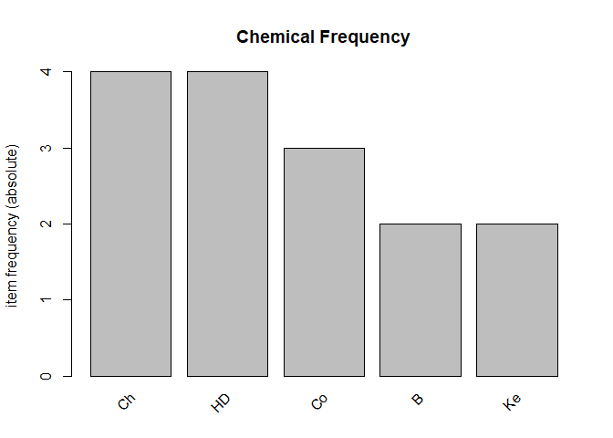

Apriori_Algorithm_3
================
Donald
2024-03-10

## R Markdown

This is an R Markdown document. Markdown is a simple formatting syntax
for authoring HTML, PDF, and MS Word documents. For more details on
using R Markdown see <http://rmarkdown.rstudio.com>.

When you click the **Knit** button a document will be generated that
includes both content as well as the output of any embedded R code
chunks within the document. You can embed an R code chunk like this:

``` r
library(arules)
```

    ## Warning: package 'arules' was built under R version 4.3.3

    ## Loading required package: Matrix

    ## 
    ## Attaching package: 'arules'

    ## The following objects are masked from 'package:base':
    ## 
    ##     abbreviate, write

``` r
transactions3 <- as(
  list(
    c("HD", "B", "Ke"),
    c("HD", "B"),
    c("HD", "Co", "Ch"),
    c("Co", "Ch"),
    c("Ch", "Ke"),
    c("HD", "Co", "Ch")
  ),
  "transactions"
)
```

``` r
rules2 <- apriori(transactions3, parameter = list(supp = 0.3334, conf = 0.6))
```

    ## Apriori
    ## 
    ## Parameter specification:
    ##  confidence minval smax arem  aval originalSupport maxtime support minlen
    ##         0.6    0.1    1 none FALSE            TRUE       5  0.3334      1
    ##  maxlen target  ext
    ##      10  rules TRUE
    ## 
    ## Algorithmic control:
    ##  filter tree heap memopt load sort verbose
    ##     0.1 TRUE TRUE  FALSE TRUE    2    TRUE
    ## 
    ## Absolute minimum support count: 2 
    ## 
    ## set item appearances ...[0 item(s)] done [0.00s].
    ## set transactions ...[5 item(s), 6 transaction(s)] done [0.00s].
    ## sorting and recoding items ... [3 item(s)] done [0.00s].
    ## creating transaction tree ... done [0.00s].
    ## checking subsets of size 1 2 done [0.00s].
    ## writing ... [4 rule(s)] done [0.00s].
    ## creating S4 object  ... done [0.00s].

``` r
inspect(rules2)
```

    ##     lhs     rhs  support   confidence coverage  lift count
    ## [1] {}   => {Ch} 0.6666667 0.6666667  1.0000000 1.0  4    
    ## [2] {}   => {HD} 0.6666667 0.6666667  1.0000000 1.0  4    
    ## [3] {Co} => {Ch} 0.5000000 1.0000000  0.5000000 1.5  3    
    ## [4] {Ch} => {Co} 0.5000000 0.7500000  0.6666667 1.5  3

``` r
library(arulesViz)
```

    ## Warning: package 'arulesViz' was built under R version 4.3.3

``` r
itemFrequencyPlot(transactions3, topN = 5, type = "absolute", main = "Chemical Frequency")
```

<!-- -->
